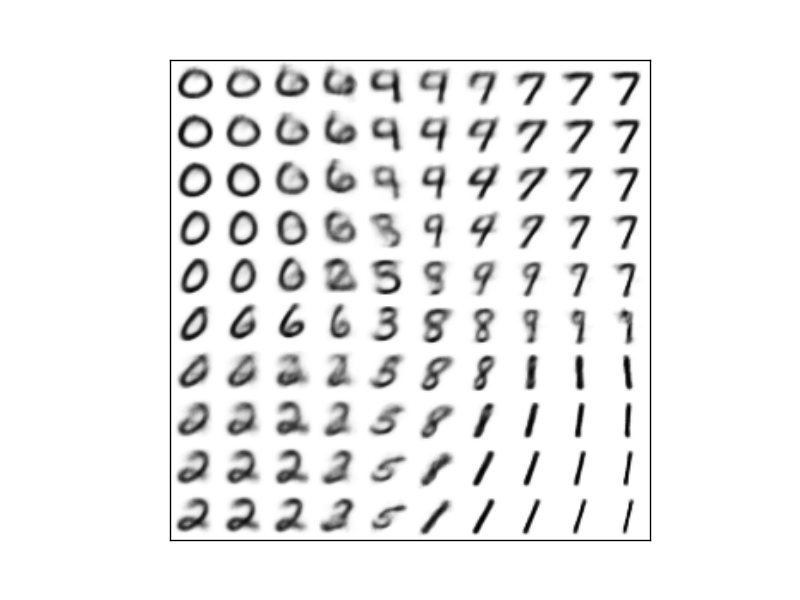

# Deep Learning

## Description

Code for the labs of the [Deep Learning](http://coursecatalogue.uva.nl/xmlpages/page/2017-2018-en/search-course/course/38305) course of the MSc in Artificial Intelligence at the University of Amsterdam.

### Lab 1 - Neural Networks, Convolutions and TensorFlow

One of the core problems in Computer Vision is that of Image Classification, which consists of assigning a label to an image from a fixed set of categories. In this work we explore Neural Network-based approaches towards solving this problem using the CIFAR-10 dataset. We perform extensive experimentation on hyperparameter effect for the MLP architecture. According to our experimental results, the convolutional architectures achieved significantly higher performance. [<a href="assignment_1/pen_paper_gallegoposada.pdf">Theoretical Exercises</a>] - [<a href="assignment_1/report_gallegoposada.pdf">Report</a>]

### Lab 2 - Recurrent Neural Networks

In this work we explore the capabilities of Recurrent Neural Networks (RNNs) and Long Short-Term Networks (LSTMs) for language modelling. In the first part we apply this models to a synthetic dataset of palindrome numbers; and in the second part we use a stacked LSTM architecture to learn and generate text trained on real books. Our experiments show a clear advantage of LSTMs over RNNs for learning dependencies which span over very large time steps. This advantage in turn allows for a good performance in the text generation task. [<a href="assignment_2/gallegoposada_assignment2.pdf">Report</a>]

*The bold characters are picked randomly and used the initialize the LSTM state.*

#### Samples during training on the Grimms’ Fairy Tales
|Train Step | Sampled Text |
|:-------------------------:|-------------------------|
|0 | **7**2qoU)qV:UUD7Pb9wg8HAJ:606u1(h4BMN3FuZ!(cu59;dQWSOT0-E0DientlAU0b6zK|
|3000 | **d** gone, and said, Wifhin, so no? I flew to me have I not have her shill came boy, the room|
|6000 | **Q**ueen, and they went as before, and restored and spread and beasts. And say needle, and had|
|9000 | **Y**ou sit into his eat and at an each of the king s bride should go into the golden bird am I!|
|12000 | **J**ust take home again, I may go into his husband in the courtyard of dress; and how she saw|
|15000 | **G**retel off again in the garden. With all my heart and more fellow, and they were once tired; b|

#### Samples during training on Don Quijote de la Mancha
|Train Step | Sampled Text |
|:-------------------------:|-------------------------|
| 0 |  **N**0É0Aü„As2PoGxLwí ÉcJéTy 3!Á-PeLK4A:ZyúHí?Q!449e’ñ¿hc’3Tc(ñrs;36üáhÑ’G |
| 3000 |  -dijo Sancho- que a decirlo de nadir como las comestamentes anday de lo que así se acompaña |
| 6000 |  **ü**era de no saber caballero de la ruega por su corta que la llama a poner las hermosas |
| 9000 |  **Y** padres y allí se consentiría de mi amigo. Pero, viendo que había sido salir de don Quijote |
| 12000 |  **É**stos, así de sus almas y abajos los dueñas de la buena caballería en la cual y pusiese a quien |
| 15000 |  **L**o que antes se puedo vencido bien hermo de escudero, la presencia con los diablos y responde |

### Lab 3 - Generative Models

In this assignment we study how the problem of intractability arises in generative modelling, and how Variational Inference deals with that intractability. We train a Naive Bayes model and a Variational Autoencoder to generate images from the MNIST dataset. [<a href="assignment_3/gallegoposada_assignment3.pdf">Report</a>]

   
  <i>Manifold learned by the VAE</i>

## Dependencies
- Tensorflow
- SciPy
- NumPy
- Matplotlib

## Copyright

Copyright © 2017 Jose Gallego.

This project is distributed under the <a href="LICENSE">MIT license</a>. This was developed as part of the Deep Learning course taught by Efstratios Gavves at the University of Amsterdam. Please follow the <a href="http://student.uva.nl/en/content/az/plagiarism-and-fraud/plagiarism-and-fraud.html">UvA regulations governing Fraud and Plagiarism</a> in case you are a student.

